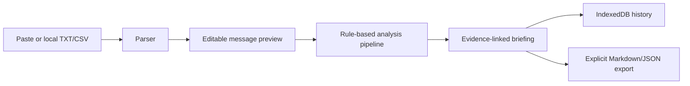

# Briefme Architecture

## System goal

Briefme turns an unread conversation into an evidence-linked briefing without requiring an account, remote database, analytics SDK, or cloud model.

## Runtime flow

## Module boundaries

- `src/parser/parser.ts` converts untrusted text into stable, source-addressable messages and preserves malformed lines.
- `src/analysis/engine.ts` applies deterministic signal extraction: deadlines, tasks, assignees, mentions, decisions, questions, risk, and priority scoring.
- `src/storage/storage.ts` owns persistence and degrades to an in-memory adapter when IndexedDB is unavailable or blocked.
- `src/utils/export.ts` produces user-triggered local exports with safe filenames.
- `src/App.tsx` coordinates UI state and navigation; domain logic stays outside the view layer.
- `server.mjs` is an optional deployment adapter for the Gemini route. GitHub Pages uses the local-first static path and does not require that server.

## Design decisions

1. **Evidence over opaque summaries:** every finding carries source message IDs.
2. **Uncertainty over invented facts:** relative or ambiguous dates remain unresolved.
3. **Determinism over hidden inference:** the engine version is stored with each analysis.
4. **Graceful degradation:** local analysis and memory storage remain usable without credentials, network, or IndexedDB.
5. **Static-first deployment:** the public app is deployable to GitHub Pages with no backend dependency.

## Quality gates

Every push runs type checking, Vitest, and a repository-path production build through GitHub Actions before the Pages artifact is published.
